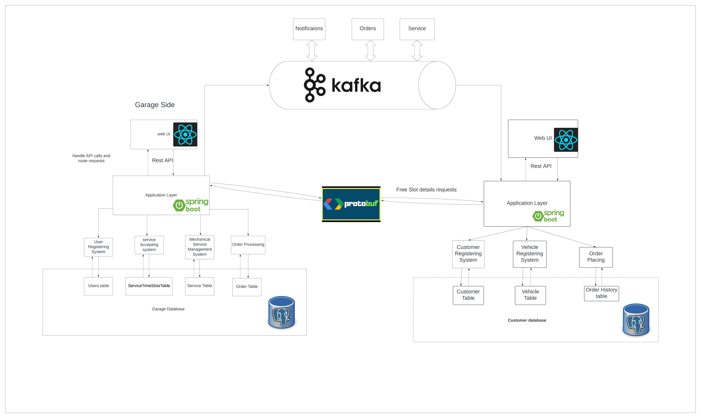
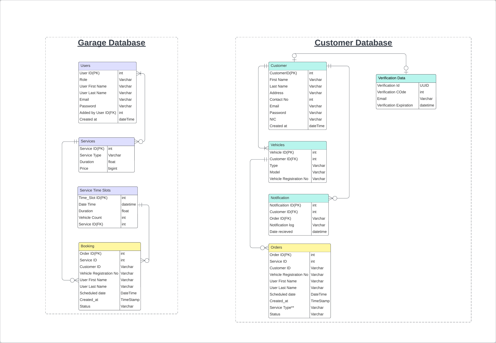

# 🛠️ Garage Service Management System

<!-- 

-->

## 🚗 Overview

Garage Service Management System is a full-stack, event-driven platform built to manage vehicle service bookings, enabling seamless coordination between **garage staff** and **vehicle owners**. Inspired by real-world service centers like AutoMiraj, it follows a scalable, microservices-based architecture with real-time communication via **Kafka** and **gRPC**.

---

## 🎯 Problem Statement

Most vehicle service centers rely on manual booking systems and disconnected tools, leading to inefficiency and poor customer experience. Our platform modernizes service coordination with real-time messaging, intelligent booking, and user-friendly interfaces for both garage managers and vehicle owners.

---

## 👥 Target Users

- **Garage Staff**: Service managers/admins managing bookings, time slots, and schedules.
- **Vehicle Owners**: Customers booking and tracking their vehicle services.

---

## 🚀 Key Features

- 📅 Time Slot Management with capacity limits.
- 📥 Vehicle Service Bookings with slot validation.
- 🔄 Kafka-based Event-Driven Messaging.
- 🛠️ Admin Portal for service managers.
- 🚘 Customer Portal for booking and vehicle registration.
- 🔔 gRPC APIs for real-time slot discovery.
- 🔒 JWT-based Secure Login (Spring Security).
- 📨 Kafka-triggered Booking Notifications.
- 📦 Dockerized Microservices.

---

## 🧱 Architecture Overview

Each service maintains its own PostgreSQL DB and communicates via Kafka and gRPC with protobuf.

## 🧱 Database Schema

This used PostgreSQL DB.

## 🖥️ Frontend Design

### 🔧 Garage Admin Portal (React + Ant Design)
- Role-based login & protected routes
- Time slot & booking management
- Breadcrumbs for navigation
- Real-time Kafka updates
- Form validation with AntD + Yup

### 🚙 Customer Portal (React + Ant Design)
- User registration/login
- Vehicle registration & service booking
- Real-time booking status (via Kafka)
- Authenticated routes using JWT
- Skeleton loaders & responsive UI

---

## 🔧 Backend Design

### Microservices
- **Garage Service (Spring Boot)**: Manages staff, slots, services, booking confirmation.
- **Customer Service (Spring Boot)**: Manages users, vehicles, and booking requests.
- **Kafka Topics**: 
  - `order-created` (booking request)
  - `booking-status-response` (status update)
- **gRPC Slot API** with Protobuf
- **PostgreSQL** for data persistence

---

## ⚙️ DevOps and CI/CD

- **Docker Compose** setup with:
  - Kafka + Zookeeper
  - PostgreSQL DBs
  - Frontend & Backend of both Garage & Customer services
- **Kafka UI + Adminer** for dev/test visibility
- **Environment Variables** via `.env`

---

## 🔐 Security & HCI Practices

- JWT-based Auth with role-based access
- Secure gRPC and Kafka communication
- Form validation (AntDesign)
- Real-time user feedback (success/failure)
- Route protection with `PrivateRoute`
- Responsive and accessible UIs

---

## 📄 Documents

Find system docs in the [`/documents`](./../documents) folder:

- [System Architecture](./../diagrams/SystemArchitecture.png)
- [Database Schema](./../diagrams/DatabaseER.jpeg)
- [API Contracts](./../documents/GarageAppOverview.pdf)

---

## 🛠️ Tech Stack

### Frontend
- React.js
- Ant Design
- React Router, React Query
- Yup Validation
- JWT-based Auth

### Backend
- Spring Boot 3 (Java 17)
- Apache Kafka
- gRPC + Protobuf
- PostgreSQL

### DevOps
- Docker + Compose
- Kafka UI + Adminer

---

